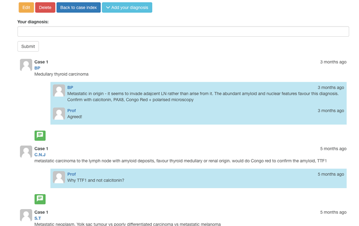

# slidedb

A virtual slide viewer, database and question/answer system, made with Python, Flask and Leaflet. Inspired by [flasky](https://github.com/miguelgrinberg/flasky), [microblog](https://github.com/miguelgrinberg/microblog) and [NYU VM](https://virtualmicroscope.iime.cloud/)

